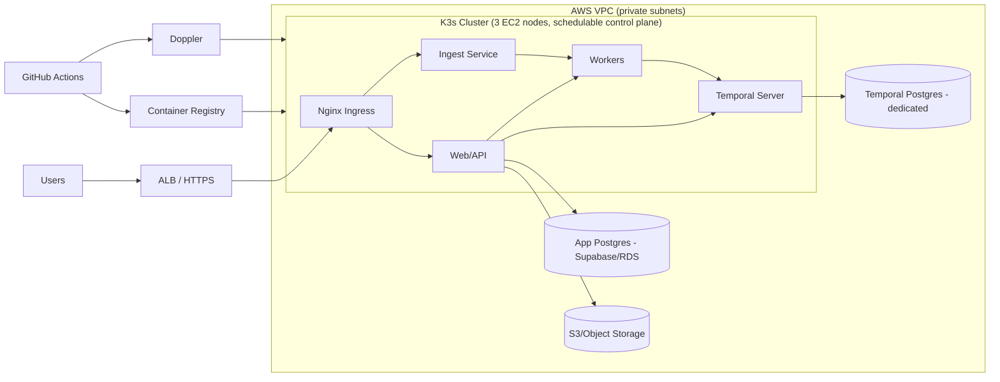
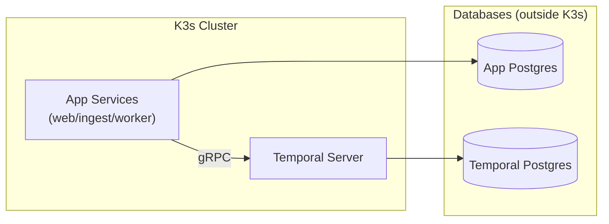
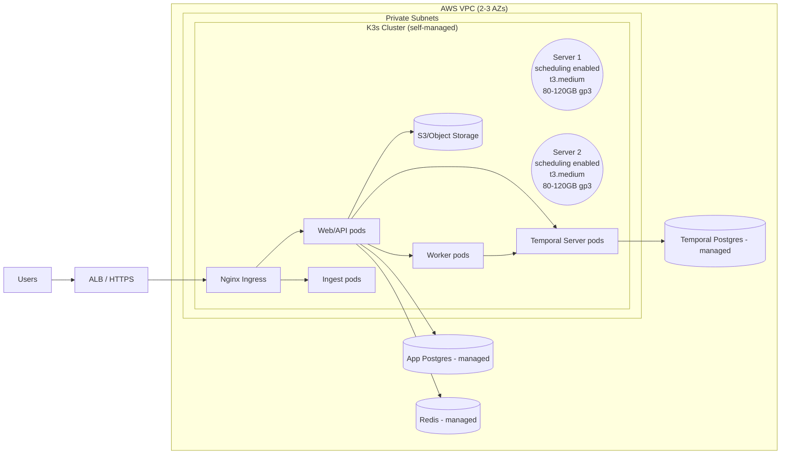

# Engineering Spec: K3s + Self-Hosted Temporal Deployment

This document defines the target production deployment for a cost-aware,
self-hosted stack on AWS using K3s on a minimal 3-node cluster (control
plane nodes are schedulable), managed Postgres for the app database, and a
dedicated Postgres for Temporal persistence. Secrets are injected at deploy
time using Doppler and envsubst, without committing secrets to git.

## Goals

- Run web, ingest, and worker services on a K3s cluster.
- Self-host Temporal in the cluster with a dedicated persistence database.
- Keep app data and Temporal data in separate Postgres databases.
- Use Doppler for secrets injection without writing secrets to disk.
- Enable reliable backups and straightforward recovery.

## Non-goals

- Multi-region active-active.
- Zero-downtime DB failover.
- Fully managed Kubernetes (EKS) or service mesh.

## Assumptions

- AWS EC2 + VPC.
- AWS region: us-east-1.
- 3 EC2 instances (t3.medium) for K3s servers, scheduling enabled, spread across 2-3 AZs.
- Managed Postgres for app DB (Supabase or RDS).
- Dedicated Postgres for Temporal (managed if possible).
- Dockerized services.
- GitHub Actions for CI/CD.
- Nginx Ingress in-cluster with ALB in front.

## Architecture



## Topology and sizing

- Minimal footprint: 3 EC2 nodes running K3s servers with scheduling enabled.
- Control plane and workloads share the same nodes for lower cost.
- Use 2 or 3 AZs; pin one server node per AZ.
- Add dedicated worker nodes later and taint servers if you need isolation.
- If throttled, upgrade by adding larger nodes (e.g., t3.large/m6i.large), cordon/drain old nodes, then remove them (not a YAML-only change).

## Networking

- ALB in public subnets.
- K3s nodes and databases in private subnets.
- Security groups:
  - ALB -> ingress only.
  - Cluster -> DB ports only.

## Databases

- App DB:
  - Managed Postgres (Supabase or RDS).
  - PITR enabled, daily snapshots, 7 to 30 day retention.
- Temporal DB:
  - Dedicated Postgres (separate from app DB).
  - PITR enabled, daily snapshots.
  - Separate schema or database for visibility.

## Database model (two Postgres databases)

Temporal is a Dockerized service, but it still needs a Postgres database for
persistence. Your web app also needs its own Postgres database. These should be
logically separate, and ideally hosted separately for isolation.

Core rule:
- Web/ingest/worker -> App DB
- Temporal server -> Temporal DB



### Placement options

1) Preferred (production-ready):
   - App DB: managed Postgres (Supabase/RDS).
   - Temporal DB: separate managed Postgres instance.

2) Acceptable for early stage:
   - Single managed Postgres instance with two databases:
     - `app_db` for the app
     - `temporal_db` for Temporal
   - Still keep separate users/roles and separate databases.

3) Only if you cannot use managed DB:
   - Run Postgres on a dedicated EC2 with EBS.
   - Do not run Postgres pods inside the K3s cluster.

### Connection flows

- App services (web/ingest/worker) use `DATABASE_URL` -> App DB.
- Temporal server uses `TEMPORAL_DB_URL` -> Temporal DB.
- Temporal workers do not talk to the Temporal DB directly; they talk to the
  Temporal server over gRPC.

### Why separate them

- Isolation: Temporal workloads should not compete with app queries.
- Reliability: DB failures should not take down both systems.
- Scaling: you can scale or tune each DB independently.

## Temporal deployment

- Deploy Temporal via Helm.
- Configure persistence to the Temporal database.
- Start with 1 replica per Temporal service, scale to 2+ if needed.
- Temporal task queues are internal; no extra queue service required.

## Application deployment

- Deploy web, ingest, worker as K8s Deployments.
- Use HPA based on CPU or custom metrics.
- Add resource requests and limits for stability.

## Secrets with Doppler + envsubst

Store templates in `deployment/` with placeholders only:

```yaml
env:
  - name: DATABASE_URL
    value: ${DATABASE_URL}
```

Inject secrets at deploy time without writing to disk:

```bash
doppler run -- bash -c 'envsubst < deployment/app.yaml | kubectl apply -f -'
```

Guidelines:
- Never commit real secret values.
- Keep rendered manifests out of git.
- Do not store Doppler tokens in the repo.

## CI/CD flow

1) Build container image.
2) Push to registry (ECR or GHCR).
3) Deploy with `kubectl apply` or Helm.
4) Use Doppler to inject secrets at deploy time.

## Backups and recovery

- App DB: PITR + daily snapshots.
- Temporal DB: PITR + daily snapshots.
- Quarterly restore tests in a staging environment.
- Document restore runbooks and verification steps.

## Observability

- Metrics: Prometheus + Grafana.
- Logs: Loki or CloudWatch.
- Traces: OpenTelemetry if needed.
- Alerts: error rate, latency, queue backlog, DB storage.

## Security

- Use IAM roles for service access to AWS resources.
- Restrict DB ingress to cluster security groups.
- TLS at ALB and in-cluster where possible.
- Rotate Doppler tokens regularly.

## Risks and mitigations

- 3-node minimal cluster shares control plane and workloads -> enforce
  requests/limits, add PDBs, and scale out with workers when needed.
- Self-hosted Temporal DB on EC2 -> use managed Postgres if possible.
- Secrets leakage -> enforce template-only manifests and CI-only rendering.

## Open decisions

- Choice of managed Postgres for Temporal persistence.
- Ingress controller: Nginx now; revisit ALB controller or Traefik later.
- Registry choice (ECR vs GHCR).
- Budget for 3-node footprint across 3 AZs vs 2 AZs.

## Appendix: K3s vs EKS (managed Kubernetes) comparison

This appendix is for decision support only. The primary spec remains K3s
(EKS is still a non-goal for this deployment), but the details below map
the current codebase workload to EC2 sizing and costs so you can compare.
K3s and EKS are alternatives; you do not run K3s on EKS.

### Workload profile (derived from this repo)

- Web/API (Next.js) on :3000
- Ingest service (Go) on :8080
- Worker service (Node.js) for background jobs
- Temporal server in-cluster (via Helm) plus optional Temporal UI
- Redis cache (`REDIS_URL` in config); prefer managed Redis in AWS
- App Postgres and Temporal Postgres are external to the cluster

### Option A: K3s on EC2 (self-managed control plane)

K3s runs the control plane (API server + etcd) on EC2 instances that you
own. These are the "server" nodes. Workers run the application pods.

#### K3s EC2 sizing: minimal 3-node HA (cost-aware)

| Role | Count | EC2 example | vCPU / RAM | EBS (gp3) | Notes |
| --- | --- | --- | --- | --- | --- |
| K3s server (schedulable) | 3 | t3.medium | 2 / 4 GiB | 80-120 GiB | etcd quorum + control plane + app pods |

Notes:
- Use 2-3 AZs; pin one server node per AZ.
- Allow scheduling on server nodes to keep total EC2 count at 3.
- If you want dedicated workers later, add worker nodes and taint servers.
- If throttled, replace t3.medium nodes with larger instances.

### Option B: EKS (managed control plane) + EC2 node groups

EKS removes the need to run control plane nodes. You still run EC2 nodes
as managed node groups (or use Fargate for pods).

#### EKS EC2 sizing: minimal 3-node (cost-aware)

| Role | Count | EC2 example | vCPU / RAM | EBS (gp3) | Notes |
| --- | --- | --- | --- | --- | --- |
| EKS node group (mixed) | 3 | t3.medium | 2 / 4 GiB | 80-120 GiB | System + app pods on same nodes |

Notes:
- EKS control plane costs extra (~$0.10/hr) regardless of node count.
- Separate system node group improves stability but adds EC2 nodes.
- Fargate can replace EC2 for some pods, but Temporal is a better fit on EC2.
- If throttled, replace t3.medium nodes with larger instances.

### Cost comparison (order-of-magnitude)

| Dimension | K3s on EC2 | EKS + EC2 |
| --- | --- | --- |
| Control plane | EC2 server nodes you pay for | Managed control plane fee (~$72/mo) |
| Worker nodes | EC2 cost | EC2 cost |
| HA baseline | 3 server nodes | 3 worker nodes + control plane fee |
| Small clusters | Usually cheaper | Usually more expensive |
| Larger clusters | Similar (node cost dominates) | Similar + control plane fee |

Example monthly cost (us-east-1, on-demand, 730 hrs):
- EC2 only: 3 x t3.medium ~= $91/month.
- EBS gp3: 3 x 80-120 GB ~= $19-$29/month.
- EKS control plane fee: ~$72/month.

Total (rough, EC2 + EBS only):
- K3s on 3 EC2 nodes: ~$110-$120/month.
- EKS + 3 EC2 nodes: ~$180-$190/month.

Not included: ALB/NLB, NAT gateway, data transfer, RDS/Supabase, Redis, S3.

### Setup effort comparison (rough)

| Area | K3s on EC2 | EKS + EC2 |
| --- | --- | --- |
| Day-0 setup | Faster, fewer AWS primitives | Slower: IAM, VPC, EKS, node groups |
| Upgrades | You manage control plane/etcd | AWS manages control plane |
| HA | You implement HA servers | Built-in control plane HA |
| Ongoing ops | More manual | Less manual |

### Minimal 3-node resiliency guidance (cost-aware)

These are the lowest-cost steps to avoid a single node failure taking down
all services:

- Spread nodes across 2-3 AZs to avoid AZ-level outages.
- Run at least 2 replicas for web/ingest/worker and add pod anti-affinity.
- Keep Temporal at 1 replica for cost, or 2 replicas for stronger uptime.
- Keep Postgres and Redis outside the cluster (managed services).
- Add PodDisruptionBudgets for web/ingest/worker to avoid draining all pods.

Scaling note:
- Instance size is set in IaC (Terraform/ASG or EKS node group), not in app
  YAML. To upgrade, add larger nodes, cordon/drain old nodes, then remove.

### Mermaid: K3s on EC2 topology



### Mermaid: EKS + EC2 topology

```mermaid
flowchart LR
  U[Users] --> ALB[ALB / HTTPS]
  ALB --> INGRESS[Nginx Ingress]

  CP[Managed EKS Control Plane<br/>no EC2]

  subgraph VPC[AWS VPC (2-3 AZs)]
    subgraph PrivateSubnets[Private Subnets]
      subgraph NodeGroup[EKS Node Group (EC2)]
        N1((Node 1<br/>mixed pods<br/>t3.medium<br/>80-120GB gp3))
        N2((Node 2<br/>mixed pods<br/>t3.medium<br/>80-120GB gp3))
        N3((Node 3<br/>mixed pods<br/>t3.medium<br/>80-120GB gp3))
        INGRESS --> WEB[Web/API pods]
        INGRESS --> INGEST[Ingest pods]
        WEB --> WORKERS[Worker pods]
        WEB --> TEMP[Temporal Server pods]
        WORKERS --> TEMP
      end
    end

    WEB --> APPDB[(App Postgres - managed)]
    TEMP --> TEMPDB[(Temporal Postgres - managed)]
    WEB --> REDIS[(Redis - managed)]
    WEB --> S3[(S3/Object Storage)]
  end

  CP --> NodeGroup
```

### Migration analysis: K3s -> EKS (managed Kubernetes)

Bottom line: migration is generally straightforward because K3s is still
Kubernetes. Most manifests and Helm charts work unchanged, but cloud
integrations (ingress, storage, IAM) need adjustment.

What carries over cleanly:
- Deployments, Services, ConfigMaps, Secrets, HPA, and most Helm values.
- Container images and CI/CD flows (registry, tags).
- External dependencies already outside the cluster (Postgres, Redis, S3).

What typically needs changes:
- Ingress: K3s often ships with Traefik; EKS commonly uses Nginx + AWS Load
  Balancer Controller. Ingress annotations differ.
- Storage: EKS uses EBS/EFS CSI drivers and StorageClasses; K3s defaults may
  not exist in EKS.
- IAM: replace K3s node instance profile use-cases with IRSA (IAM Roles for
  Service Accounts) for S3 or other AWS access.
- CNI/networking: AWS VPC CNI behavior and pod IPs differ from K3s defaults.
- Cluster add-ons: metrics-server, cert-manager, external-dns, log agents
  may need EKS-specific installation.

Recommended migration path (low risk):
1) Stand up EKS in parallel (VPC, node groups, ingress, CSI drivers).
2) Deploy the same Helm charts/manifests using a new namespace.
3) Point to the same external services (App DB, Temporal DB, Redis, S3).
4) Validate health, scaling, and ingestion end-to-end.
5) Cut over traffic by switching the ALB/DNS target to the EKS ingress.
6) Decommission K3s after traffic is stable.

Risk points to plan for:
- Any in-cluster PersistentVolumes need data migration (EBS snapshots or
  app-level export/import). Avoid PV reliance where possible.
- Temporal and app DBs must remain external to avoid state migration.
- Ingress cutover should be staged with low TTL and rollback plan.
